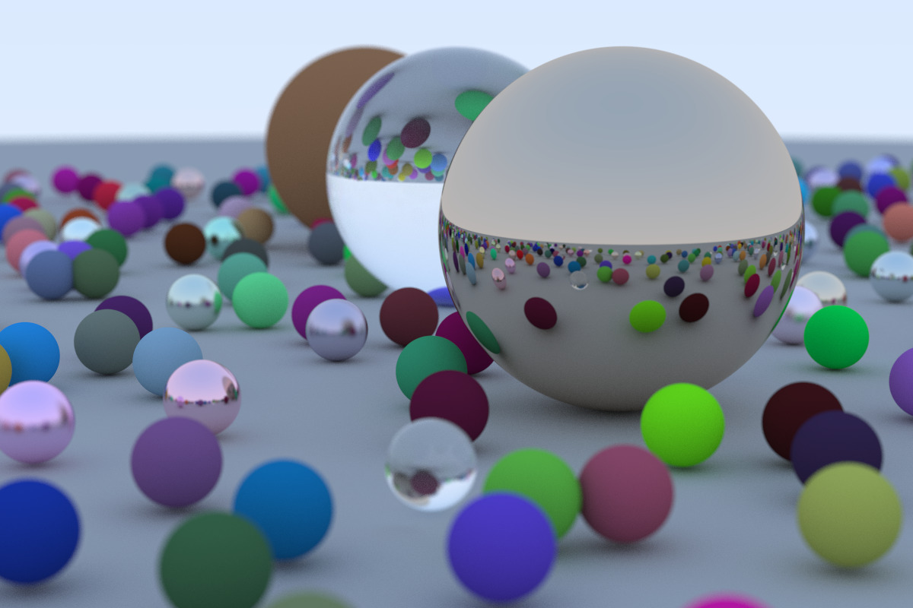

# Raytracer!"

[](LICENSE)

This repository contains an implementation of a raytracer based on the popular book ["Ray Tracing in One Weekend"](https://raytracing.github.io/books/RayTracingInOneWeekend.html) by Peter Shirley. The project is designed to provide an introduction to the concepts of ray tracing and guide you through building a simple, yet powerful, ray tracing renderer from scratch.



## Table of Contents

- [Introduction](#introduction)
- [Features](#features)
- [Dependencies](#dependencies)
- [Installation and Usage](#installation-and-usage)
- [Acknowledgements](#acknowledgements)
- [License](#license)

## Introduction

Ray tracing is a rendering technique used in computer graphics to generate photorealistic images by simulating the physical behavior of light. This project implements a basic raytracer that can render 3D scenes with various geometric shapes, materials, and lighting conditions.

## Features

- Basic ray tracing functionality
- Support for sphere primitives
- Lambertian, metal, and dielectric materials
- Anti-aliasing
- Positionable Camera
- Defocus Blur
- Motion Blur
- Bounding Volumn Hierarchies
- Perlin Noise Texture

## Dependencies

The following libraries and tools are required to build and run the project:

- C++17 compatible compiler (e.g., GCC, Clang, or MSVC)
- MacOS (Currently it does not support Windows due to bug in `ppm` format I/O)

## Installation and Usage

To build and run the raytracer, follow these steps:

1. Clone the repository:

```
git clone https://github.com/mrn3088/Graphics-RayTracer.git
cd Graphics-RayTracer
```

2. Run Makefile to compile the project:
```
make
```

3. Run the raytracer executable:
```
./render.sh
```


This will generate a `image.ppm` file in the current directory, which contains the rendered image of the final scene.

## Acknowledgements

- Peter Shirley for his book ["Ray Tracing in One Weekend"](https://raytracing.github.io/books/RayTracingInOneWeekend.html) and providing the foundation for this project.

## License

This project is licensed under the MIT License. See the [LICENSE](LICENSE) file for more details.
